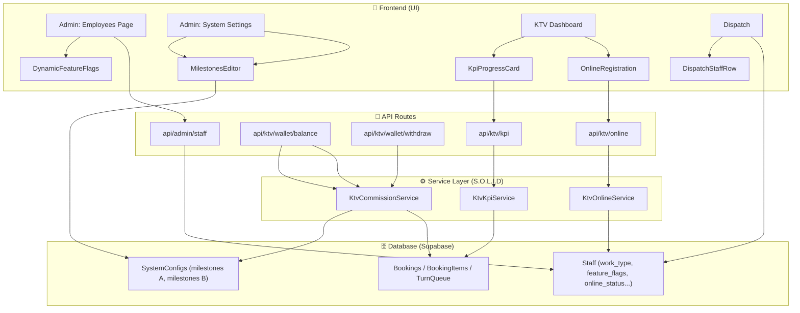

# Kế Hoạch Đại Tu Hệ Thống KTV: Phân Loại A/B/C, S.O.L.I.D API & System Configs

Bản kế hoạch này tổng hợp toàn bộ các quyết định kiến trúc, thay đổi Database, API và UI cho cuộc đại tu quản lý nhân sự KTV. Đây là tài liệu thiết kế (Blueprint) chính thức để tiến hành code.

---

## 1. Tầng Database & Migration
Hệ thống sẽ không tạo thêm nhiều bảng hay cột rác, thay vào đó áp dụng chiến lược Hybrid:

**1.1. Thêm cột `work_type` vào bảng `Staff`**
- Chạy SQL Migration thêm cột `work_type` (kiểu `text`). Giá trị mặc định là `TYPE_A`.
- Các giá trị hợp lệ:
  - **`TYPE_A` (Cơ bản):** Nhân viên làm full-time, có ca làm việc cố định, tính lương theo mốc tua cơ bản.
  - **`TYPE_B` (Hợp tác/Part-time):** Đối tác chuyên làm VIP/Trị liệu, thời gian làm tự do, nhận giá tua cao (180k/h).
  - **`TYPE_C` (Nhập tay/Freelance):** Khách vãng lai, sinh ra tự động từ bảng điều phối để chữa cháy, không có tài khoản thật.

**1.2. Tận dụng cột `feature_flags` (JSONB) đã có trong `Staff`**
Mọi tính năng bật/tắt riêng cho từng KTV sẽ được lưu thành chuỗi JSON. Ví dụ:
- `TYPE_A` lưu: `{ "overtime_enabled": true, "shift_bonus_enabled": true }`
- `TYPE_B` lưu: `{ "fixed_order_bonus_enabled": true, "vip_menu_enabled": true, "kpi_target_hours": 80 }`

**1.3. Tạo bảng Cuốn Tháng & Cuốn Năm (Tối ưu tốc độ + Tránh lỗi 1000 dòng)**

> ⚠️ **VẤN ĐỀ:** Supabase giới hạn trả về tối đa 1000 dòng mỗi query. Hiện tại `KTVDailyLedger` đã có 79 dòng/KTV (tính từ 04/05). Nếu hoạt động thêm 1 năm = ~365 dòng/KTV × 10 KTV = 3.650 dòng. Nếu không cuốn, hệ thống sẽ chậm dần và vỡ ngưỡng 1000 dòng.

**Bảng `KTVMonthlyLedger` (Cuốn Tháng):**
```sql
CREATE TABLE "KTVMonthlyLedger" (
    id UUID DEFAULT gen_random_uuid() PRIMARY KEY,
    staff_id TEXT NOT NULL,
    month INTEGER NOT NULL,        -- VD: 7
    year INTEGER NOT NULL,         -- VD: 2026
    total_commission NUMERIC DEFAULT 0,
    total_tip NUMERIC DEFAULT 0,
    total_bonus NUMERIC DEFAULT 0,
    total_penalty NUMERIC DEFAULT 0,
    total_bookings INTEGER DEFAULT 0,
    total_minutes INTEGER DEFAULT 0,   -- Tổng phút làm tua (dùng cho KPI Loại B)
    synced_at TIMESTAMPTZ DEFAULT NOW(),
    UNIQUE(staff_id, month, year)
);
```

**Bảng `KTVYearlyLedger` (Cuốn Năm):**
```sql
CREATE TABLE "KTVYearlyLedger" (
    id UUID DEFAULT gen_random_uuid() PRIMARY KEY,
    staff_id TEXT NOT NULL,
    year INTEGER NOT NULL,         -- VD: 2026
    total_commission NUMERIC DEFAULT 0,
    total_tip NUMERIC DEFAULT 0,
    total_bonus NUMERIC DEFAULT 0,
    total_penalty NUMERIC DEFAULT 0,
    total_bookings INTEGER DEFAULT 0,
    total_minutes INTEGER DEFAULT 0,
    synced_at TIMESTAMPTZ DEFAULT NOW(),
    UNIQUE(staff_id, year)
);
```

**Cron Job cuốn sổ:** Mở rộng `cron/sync-daily-ledger/route.ts`:
- Cuối mỗi ngày: Tổng kết `KTVDailyLedger` (đã có).
- **Đầu mỗi tháng (00:05 VN ngày 1):** SUM tất cả `KTVDailyLedger` của tháng trước → UPSERT vào `KTVMonthlyLedger`.
- **Đầu mỗi năm (00:10 VN ngày 1/1):** SUM tất cả `KTVMonthlyLedger` của năm trước → UPSERT vào `KTVYearlyLedger`.

> 🔒 **Quy tắc an toàn Cron cuốn sổ:**
> 1. **KHÔNG XÓA DailyLedger** sau khi cuốn. Giữ lại toàn bộ dữ liệu Daily để audit/tra cứu. Monthly/Yearly chỉ là "cache tăng tốc".
> 2. **Idempotent (Chạy lại không sai):** Dùng UPSERT (`ON CONFLICT (staff_id, month, year) DO UPDATE`). Nếu cron fail rồi chạy lại → kết quả giống hệt.
> 3. **Error Handling:** Nếu UPSERT fail cho 1 KTV → Log error + tiếp tục KTV khác. KHÔNG dừng toàn bộ batch.
> 4. **WalletAdjustments:** Nếu Admin sửa tiền đơn cũ (tạo WalletAdjustment), Monthly **KHÔNG cần cập nhật** vì Adjustments được tính riêng (query độc lập, không nằm trong Ledger).

**Luồng query tối ưu (Ví dụ: Tính số dư tính từ 04/05/2026 đến 22/07/2026):**
```
Bước 1: Đọc KTVYearlyLedger (0 dòng — chưa cuốn năm)
Bước 2: Đọc KTVMonthlyLedger tháng 5 + tháng 6 (2 dòng thay vì 57 dòng Daily!)
Bước 3: Đọc KTVDailyLedger tháng 7 chưa cuốn (~22 dòng)
Bước 4: Realtime hôm nay từ Bookings
→ Tổng = Yearly + Monthly + Daily + Realtime = Chính xác 100%
→ Chỉ đọc ~24 dòng thay vì 79+ dòng
```

**Đặc biệt:** Cột `total_minutes` trong `KTVMonthlyLedger` sẽ phục vụ trực tiếp cho tính năng **KPI 80h/tháng** của KTV Loại B (không cần quét lại từng Booking).

---

## 2. Giải pháp Triệt để cho KTV Loại C (Lễ tân nhập tay)
Đây là cốt lõi để sửa lỗi hiển thị sai tên trên Bill/Feedback (vấn đề "KTV Ngoài 1" do bộ đệm Cache của Next.js).

**2.1. Logic sinh tự động tại `app/reception/dispatch/actions.ts`**
- Xóa bỏ việc sử dụng mã giả `EXT_1`, `EXT_2`. Các mã giả này trước đây gây ra **lỗi văng ra Dashboard (Crash màn hình)** do chúng không phải là định dạng UUID hợp lệ của Database, làm hỏng các truy vấn liên quan.
- Khi Lễ tân gõ tên một người không có trong danh sách (VD: "Chị Lan"), hàm Server Action sẽ:
  1. **Tìm kiếm trùng tên** (exact match, case-insensitive) trong bảng `Staff` với `work_type = 'TYPE_C'`.
  2. **Nếu TRÙNG TÊN** → Reuse record cũ, trả về UUID đã có. KHÔNG tạo mới.
  3. **Nếu KHÔNG TRÙNG** → Insert 1 dòng mới vào bảng `Staff` với:
     - `full_name`: "Chị Lan"
     - `work_type`: `TYPE_C`
     - `status`: `ĐANG LÀM`
  4. Trả về đúng `id` (UUID thật) để gán vào Booking.

> 💡 **Tại sao Reuse?** Nếu mỗi lần gõ "Chị Lan" đều tạo record mới → Bảng Staff sẽ tràn rác (100+ dòng "Chị Lan"). Reuse giúp giữ sạch DB và Bill/Feedback luôn mapping đúng 1 người.

- Nhờ vậy:
  1. Fix dứt điểm lỗi văng màn hình khi gán ca.
  2. Từ nay mọi hóa đơn, feedback đều fetch được đúng tên "Chị Lan" từ DB thay vì hiển thị "KTV Ngoài 1".

**2.2. Dọn rác màn hình Admin**
- Vì Loại C sinh ra liên tục sẽ làm rác trang Quản lý Nhân viên (`app/admin/employees`).
- Code sẽ được update để **tự động filter (ẩn) toàn bộ `work_type === 'TYPE_C'`** khỏi danh sách. Quản lý sẽ chỉ nhìn thấy Loại A và Loại B.

---

## 3. Tầng Cài đặt Hệ thống (System Settings - Dành cho Admin/Dev)
Tuyệt đối KHÔNG gán cứng giá tiền vào code hay hiển thị cấu hình giá ở Dashboard KTV. Mọi cấu hình mốc tiền tua (Milestones) phải nằm ở Global Settings (`SystemConfigs` table), quản lý tại `app/admin/settings`.

**Giao diện nhập tay (UX Flow chi tiết):**
1. Admin vào **Cài đặt → Hệ thống** → Kéo xuống mục "Cấu hình Tiền Tua".
2. Hiển thị **2 Tab** song song: `Tab Loại A (100k/h)` | `Tab Loại B (180k/h)`.
3. Mỗi Tab là 1 bảng dạng Interactive Table:
   - Cột 1: **Số phút** (input number, min=1, chỉ nhận số nguyên dương)
   - Cột 2: **Số tiền (VNĐ)** (input number, min=1000)
   - Cột 3: Nút **Xóa** (icon thùng rác)
4. Cuối bảng: Nút **"+ Thêm mốc"** → Thêm 1 dòng mới vào bảng.
5. Nút **"Lưu"** → Validate: Không trùng số phút, tiền phải > 0, sắp xếp tăng dần theo phút → Lưu vào `SystemConfigs` dạng JSON.
6. **Confirm trước khi lưu:** Hiển thị dialog "Thay đổi sẽ áp dụng cho TẤT CẢ đơn mới. Xác nhận?".

> ⚠️ **Lưu ý:** Thay đổi milestones chỉ áp dụng cho đơn **MỚI** tính từ thời điểm lưu. Các đơn cũ đã tính tiền rồi KHÔNG bị ảnh hưởng (vì tiền cũ đã nằm trong Ledger).

**Giao diện nhập tay Điểm thưởng (Bonus):**
Nằm cùng trang Cài đặt → Hệ thống, phía dưới mục "Cấu hình Tiền Tua":

1. **Mục "Điểm thưởng KTV Loại A (theo Ca)":**
   - 3 dòng input tương ứng 3 ca:
     | Ca | Điểm thưởng mặc định | Ghi chú |
     |----|---------------------|--------|
     | Ca 1 (Sáng) | `20` điểm | Admin có thể sửa tay |
     | Ca 2 (Chiều) | `20` điểm | Admin có thể sửa tay |
     | Ca 3 (Tối) | `30` điểm | Admin có thể sửa tay |
   - Lưu vào `SystemConfigs`: keys `ktv_shift_1_bonus`, `ktv_shift_2_bonus`, `ktv_shift_3_bonus`.

2. **Mục "Bonus cố định KTV Loại B (theo Đơn)":**
   - 1 input duy nhất: **Số tiền bonus mỗi đơn** (mặc định `20,000đ`).
   - Lưu vào `SystemConfigs`: key `ktv_type_b_fixed_order_bonus`.

**3.1. Tách biệt 2 Bộ Mốc Tua (Milestones)**
- **Bộ Mốc Tua Loại A (Cơ bản - 100k/h):** 
  - Lưu dạng JSON trong `SystemConfigs`.
  - Giá trị ĐẦY ĐỦ: `{"1": 2000, "30": 50000, "45": 75000, "60": 100000, "70": 115000, "90": 150000, "100": 165000, "120": 200000, "180": 300000, "300": 500000}`.
- **Bộ Mốc Tua Loại B (VIP/Trị liệu - 180k/h):** 
  - Lưu dạng JSON mới trong `SystemConfigs`.
  - Giá trị ĐẦY ĐỦ (Nhân tỷ lệ 1.8 từ Loại A): `{"1": 3600, "30": 90000, "45": 135000, "60": 180000, "70": 207000, "90": 270000, "100": 297000, "120": 360000, "180": 540000, "300": 900000}`.

---

## 4. Tầng API & Service (Chuẩn S.O.L.I.D)
Tái cấu trúc luồng tính tiền để loại bỏ sự phân mảnh (Code smell) hiện tại.

**4.1. Hợp nhất vào Service Layer (Deprecate SQL)**

> ⚠️ **VẤN ĐỀ HIỆN TẠI: Hệ thống đang bị "PHÂN MẢNH" — 2 nơi tính tiền khác nhau**

| Nơi | File | Cách tính | Vấn đề |
|-----|------|-----------|--------|
| API **Xem số dư** | `wallet/balance/route.ts` | Dùng **Node.js** (`KtvCommissionService`) | ✅ Mới, đúng, dễ bảo trì |
| API **Rút tiền** | `wallet/withdraw/route.ts` (dòng 24) | Dùng **SQL RPC** (`supabase.rpc('get_ktv_wallet_balance')`) | ❌ Cũ, nằm chìm trong DB, khó sửa |

**Tại sao nguy hiểm?**
1. **Sai lệch số liệu:** Node.js tính ra 500k nhưng SQL tính ra 480k → KTV thấy có 500k nhưng rút không được.
2. **Khó bảo trì khi thêm Loại B:** Phải sửa **2 NƠI** cùng lúc (Node.js + SQL function trong DB). Quên 1 là lỗi ngay.
3. **SQL nằm trong DB:** Muốn sửa phải viết file Migration mới, deploy lên Supabase, rất nặng nề.

**Giải pháp — Gom về 1 nguồn duy nhất (Node.js Service):**
```
TRƯỚC (Phân mảnh - RỦI RO):
  App Xem Ví  → Node.js (KtvCommissionService)
  App Rút Tiền → SQL RPC (get_ktv_wallet_balance) ← NGUỒN KHÁC!

SAU (Hợp nhất - AN TOÀN):
  App Xem Ví  → Node.js (KtvCommissionService) ← CÙNG 1 NGUỒN
  App Rút Tiền → Node.js (KtvCommissionService) ← CÙNG 1 NGUỒN
```

**Cách sửa cụ thể:** Trong file `withdraw/route.ts`, thay dòng 24:
```diff
- const { data: balanceResult } = await supabase.rpc('get_ktv_wallet_balance', { p_staff_id: techCode });
+ // Dùng chung logic Service giống balance/route.ts
+ const commConfig = await KtvCommissionService.getCommissionConfig(supabase, workType);
+ // ... tính toán giống hệt bên balance → đảm bảo số liệu khớp 100%
```
Từ đó cả 2 API đều "uống chung 1 nguồn nước", không bao giờ lệch số liệu nữa.

**Kế hoạch dọn dẹp SQL cũ (sau khi Deprecate thành công):**
1. **Bước 1 (Ngay):** Sửa `withdraw/route.ts` → dùng Node.js Service. Deploy và test.
2. **Bước 2 (Sau 2 tuần ổn định):** Viết Migration DROP hàm SQL:
   ```sql
   DROP FUNCTION IF EXISTS get_ktv_wallet_balance(text);
   DROP FUNCTION IF EXISTS get_mins_from_times(text, text);
   -- GIỮ LẠI get_ktv_wallet_timeline() vì có thể Admin report đang dùng
   ```
3. **Bước 3 (Tùy chọn):** Dọn bảng `TurnLedger` — xóa các record orphan (booking_id không tồn tại hoặc status = IN_PROGRESS). Bảng này vẫn giữ lại để log lịch sử, chỉ dọn rác.

> ⚠️ **KHÔNG DROP ngay hàm SQL khi vừa deploy.** Chờ 2 tuần chạy ổn rồi mới dọn, phòng trường hợp cần rollback.

**4.2. Quy tắc Tính tiền Tua BẮT BUỘC (Tách lẻ dịch vụ)**

> ⚠️ **QUY TẮC SẮT ĐÁ — KHÔNG ĐƯỢC VI PHẠM:**
> Dù Lễ tân gộp bao nhiêu dịch vụ vào cùng 1 Đơn, hệ thống **TUYỆT ĐỐI KHÔNG** cộng dồn tổng thời gian để tính 1 lần. Phải bóc tách **TỪNG dịch vụ riêng lẻ** → tra mốc tiền riêng → rồi mới cộng tổng.
>
> *Ví dụ:* Đơn có 2 DV (30p + 45p)
> → Lần 1: tra mốc 30p = 50k (Loại A) hoặc 90k (Loại B)
> → Lần 2: tra mốc 45p = 75k (Loại A) hoặc 135k (Loại B)
> → Tổng tiền tua = 125k (Loại A) hoặc 225k (Loại B) ✅
> → ❌ SAI: Gộp 75p rồi tính 1 lần = bị sai mốc!

**Minh chứng Code hiện tại ĐÃ ĐÚNG** (file `app/api/ktv/wallet/balance/route.ts`, dòng 116-122):
```typescript
let bookingCommission = 0;
for (const item of relevantItems) {  // ← Duyệt TỪNG dịch vụ riêng
    const fallbackDuration = svcDurationMap[String(item.serviceId)] || 60;
    let itemDuration = KtvCommissionService.calculateItemDuration(item, techCode, fallbackDuration);
    bookingCommission += KtvCommissionService.calcCommission(
        itemDuration, commConfig.milestones, commConfig.ratePer60  // ← Tính tiền RIÊNG cho từng DV
    );
}
```

**Cách mở rộng AN TOÀN cho Loại B:** Chỉ cần sửa **1 dòng duy nhất** (dòng 24 cùng file):
```diff
- const commConfig = await KtvCommissionService.getCommissionConfig(supabase);
+ const commConfig = await KtvCommissionService.getCommissionConfig(supabase, workType);
// workType = 'TYPE_A' → nạp key "ktv_commission_milestones" (bộ 100k/h)
// workType = 'TYPE_B' → nạp key "ktv_commission_milestones_type_b" (bộ 180k/h)
```
Toàn bộ vòng `for` tách lẻ ở trên **giữ nguyên 100%** — vì nó chỉ nhận `commConfig.milestones` làm đầu vào, bộ milestones nào cũng chạy được.

---

## 5. Tầng Giao diện UI/UX (Frontend)

### 5.1. Màn hình Quản lý Nhân sự (Admin - `app/admin/employees`)
Thiết kế lại Modal Thêm/Sửa nhân viên theo hướng **Tính năng Động (Dynamic UI)**:
- **Khi gán `TYPE_A`:** UI tự động hiện ra các công tắc cấu hình Tăng ca, Thưởng mốc ca. Hệ thống ngầm hiểu áp dụng bộ mốc tiền 100k/h.
- **Khi gán `TYPE_B`:** 
  - UI ẩn các công tắc của Loại A. Hệ thống ngầm hiểu áp dụng bộ mốc tiền 180k/h.
  - Hiện ra cấu hình **Chỉ tiêu Tháng (KPI)**: Ô input điền số giờ (Mặc định `80`, Admin có thể gõ sửa).

### 5.2. App KTV Dashboard (`app/ktv/dashboard`)
Giao diện App sẽ thay đổi 180 độ tùy thuộc vào ai đang đăng nhập:

- **Nếu là KTV Loại A:**
  - Hiển thị module Chấm công (Check-in/out) thông thường.
  - Hiển thị bảng Thưởng mốc ca.
- **Nếu là KTV Loại B:**
  - **THÊM MỚI Component "Chỉ tiêu Tháng":**
    - Hiển thị trực quan dưới dạng Đồng hồ cát hoặc Thanh Tiến Trình (Progress Bar).
    - **Logic tính tổng giờ ĐỘC LẬP:** Service sẽ quét tất cả các Đơn hoàn thành trong tháng, **cộng trực tiếp tổng số phút thực tế (duration)** mà KTV đã làm tua. *(Công thức: `Tổng giờ đã làm = Tổng phút / 60`)*.
    - Lấy `kpi_target_hours` trừ đi để hiển thị tiến độ (VD: `Đã làm: 45h / Mục tiêu: 80h`).
  - **THÊM MỚI Module "Đăng ký Online (Làm việc từ xa)":**
    - Vì KTV Loại B là Part-time, họ có thể ở nhà và mở App để sẵn sàng nhận khách.
    - Khi bấm "Bắt đầu nhận đơn", App yêu cầu nhập 2 thông tin:
      1. **Thời gian di chuyển đến cơ sở:** (VD: 15 phút).
      2. **Khung giờ sẵn sàng phục vụ:** (VD: 09:00 - 17:00).
    - **Logic hiển thị trên Web Khách Hàng (Menu VIP):** 
      - Nếu khách xem menu lúc 09:00 sáng và KTV *chưa* có mặt ở cơ sở, hệ thống tự động cộng 15 phút di chuyển => Báo cho khách biết KTV này có thể làm lúc **09:15**.
      - Khi KTV đến cơ sở và bấm "Điểm danh / Đã tới nơi", thời gian chờ di chuyển (15p) sẽ bị xóa bỏ. Khách book các ca tiếp theo sẽ tính đúng giờ thực tế (không bị cộng dư 15p nữa).
    - **Logic Auto-Offline (Làm mờ ảnh):**
      - Nếu đến khung giờ kết thúc (VD: 17:00) mà KTV không có đơn nào đang làm, hệ thống tự động đánh dấu KTV đó là "Nghỉ" (Offline) và **làm mờ ảnh** trên Menu Khách Hàng.
    - **Đặc quyền Lễ tân (Quầy):** Dù KTV Loại B đã quá giờ (quá 17:00) hoặc quên tắt App, Lễ tân tại quầy (bảng Điều phối) vẫn có **quyền lực tối cao** để ép gán đơn (Assign) tiếp tục cho KTV đó bình thường.

  **Edge Cases bắt buộc xử lý:**
  | Tình huống | Xử lý |
  |-----------|-------|
  | KTV đăng ký Online 9h-17h nhưng KHÔNG có đơn cả ngày | **Không tính giờ KPI.** KPI chỉ tính giờ thực tế làm tua (có BookingItem hoàn thành), không tính thời gian chờ. |
  | KTV đang làm đơn lúc 16:50, đơn kéo dài đến 17:30 | Auto-offline **KHÔNG chạy** khi KTV đang có đơn `IN_PROGRESS/CLEANING`. Chỉ auto-offline khi `TurnQueue` rỗng AND quá giờ `available_until`. |
  | KTV tắt app/mất mạng mà chưa bấm "Đã tới nơi" | Giữ nguyên `online_status = ONLINE`. Khi khách book, vẫn cộng thời gian di chuyển. Khi KTV mở lại app → hiện nhắc nhở "Bạn đã tới cơ sở chưa?". |
  | 2 khách book cùng lúc 1 KTV Loại B đang Online | Logic gán đơn **KHÔNG thay đổi** — vẫn theo TurnQueue hiện tại (FIFO). KTV nhận đơn 1 trước, đơn 2 xếp hàng. |
  | KTV quên tắt app đến 23:59 | Cron auto-offline chạy mỗi **15 phút** kiểm tra: Nếu quá `available_until` + không có đơn → set `OFFLINE`. |

---

## 6. Chi Tiết Kỹ Thuật Triển Khai (Implementation Details)

### 📌 PHASE 1: Database Migration & Backend Foundation

#### 6.1. Database Migration (SQL Files)
| # | File Migration | Mô tả |
|---|---------------|--------|
| 1 | `supabase/migrations/YYYYMMDD_add_work_type_to_staff.sql` | Thêm cột `work_type TEXT DEFAULT 'TYPE_A'` vào bảng `Staff`. Thêm CHECK constraint cho giá trị hợp lệ (`TYPE_A`, `TYPE_B`, `TYPE_C`). |
| 2 | `supabase/migrations/YYYYMMDD_add_type_b_milestones.sql` | Insert thêm 1 row mới vào `SystemConfigs` với key = `ktv_commission_milestones_type_b`, value = JSON bộ mốc 180k/h. |
| 3 | `supabase/migrations/YYYYMMDD_add_ktv_online_status.sql` | Thêm các cột phục vụ tính năng Online Part-time vào `Staff`: `online_status` (TEXT: `OFFLINE`/`ONLINE`/`AT_VENUE`), `travel_minutes` (INT), `available_from` (TIME), `available_until` (TIME). |
| 4 | `supabase/migrations/YYYYMMDD_create_monthly_yearly_ledger.sql` | Tạo 2 bảng `KTVMonthlyLedger` và `KTVYearlyLedger` (SQL đã có sẵn ở mục 1.3). Thêm index trên `staff_id` cho cả 2 bảng. |

#### 6.2. Backend Service Layer (Chuẩn S.O.L.I.D)
| # | File | Hành động | Mô tả |
|---|------|-----------|--------|
| 1 | [KtvCommissionService.ts](file:///C:/Users/ADMIN/OneDrive/Desktop/Ngan%20Ha/Quan_Tri_Va_KTV/lib/services/KtvCommissionService.ts) | **[MODIFY]** | Refactor: Thêm method `getCommissionByWorkType(staffId, workType)` → Tự động chọn bộ milestones tương ứng (A hoặc B) từ `SystemConfigs`. Áp dụng quy tắc **tách lẻ dịch vụ** (tính tiền từng segment riêng rồi cộng lại). |
| 2 | `lib/services/KtvOnlineService.ts` | **[NEW]** | Service mới quản lý trạng thái Online/Offline của KTV Loại B. |
| 3 | `lib/services/KtvKpiService.ts` | **[NEW]** | Service mới tính KPI tháng cho KTV Loại B. |

**Method Signatures chi tiết (Bắt buộc tuân thủ):**

```typescript
// === KtvCommissionService (MODIFY) ===
static async getCommissionConfig(
  supabase: SupabaseClient,
  workType: 'TYPE_A' | 'TYPE_B' = 'TYPE_A' // Mặc định TYPE_A để backward compatible
): Promise<CommissionConfig>
// workType = TYPE_A → nạp key 'ktv_commission_milestones'
// workType = TYPE_B → nạp key 'ktv_commission_milestones_type_b'

// === KtvOnlineService (NEW) ===
static async goOnline(supabase: SupabaseClient, input: {
  staffId: string;
  travelMinutes: number;    // 5-60, validate range
  availableFrom: string;    // 'HH:mm' format
  availableUntil: string;   // 'HH:mm' format
}): Promise<{ success: boolean; error?: string }>
// → UPDATE Staff SET online_status='ONLINE', travel_minutes, available_from, available_until

static async arriveAtVenue(supabase: SupabaseClient, staffId: string): Promise<void>
// → UPDATE Staff SET online_status='AT_VENUE', travel_minutes=0

static async autoOffline(supabase: SupabaseClient): Promise<{ offlinedCount: number }>
// → Cron: SELECT Staff WHERE online_status IN ('ONLINE','AT_VENUE')
//   AND available_until < NOW() AND không có đơn IN_PROGRESS → SET 'OFFLINE'

// === KtvKpiService (NEW) ===
static async getMonthlyHours(supabase: SupabaseClient, input: {
  staffId: string;
  month: number;  // 1-12
  year: number;
}): Promise<{
  totalMinutes: number;      // Tổng phút thực tế
  totalHours: number;        // totalMinutes / 60
  targetHours: number;       // Lấy từ feature_flags.kpi_target_hours (default 80)
  progressPercent: number;   // (totalHours / targetHours) * 100
  remainingHours: number;    // targetHours - totalHours
}>
// Ưu tiên: Nếu KTVMonthlyLedger đã cuốn → lấy total_minutes từ đó
// Nếu chưa cuốn (tháng hiện tại) → SUM từ KTVDailyLedger + Realtime
```

#### 6.3. API Routes
| # | File Route | Hành động | Mô tả |
|---|-----------|-----------|--------|
| 1 | `app/api/ktv/wallet/balance/route.ts` | **[MODIFY]** | Refactor: Gọi `KtvCommissionService.getCommissionByWorkType()` thay vì SQL RPC cũ. Đảm bảo trả về kết quả nhất quán cho cả Loại A và B. |
| 2 | `app/api/ktv/wallet/withdraw/route.ts` | **[MODIFY]** | Refactor: Dùng chung logic từ `KtvCommissionService` để validate số dư trước khi rút. Loại bỏ hàm SQL `get_ktv_wallet_balance`. |
| 3 | `app/api/ktv/online/route.ts` | **[NEW]** | API mới cho KTV Loại B: `POST` (goOnline/arriveAtVenue/goOffline). Gọi `KtvOnlineService`. |
| 4 | `app/api/ktv/kpi/route.ts` | **[NEW]** | API mới trả về tiến độ KPI tháng: `GET ?staffId=xxx&month=2026-07`. Gọi `KtvKpiService.getMonthlyHours()`. |
| 5 | `app/api/admin/staff/route.ts` | **[MODIFY]** | Bổ sung xử lý `work_type` và `feature_flags` khi tạo/sửa nhân viên. Filter ẩn `TYPE_C` khi list danh sách. |
| 6 | `app/api/cron/auto-offline/route.ts` | **[NEW]** | Cron chạy mỗi **15 phút**: Gọi `KtvOnlineService.autoOffline()` để tự động set `OFFLINE` cho KTV Loại B đã quá giờ `available_until` và không có đơn đang làm. |

---

### 📌 PHASE 2: Frontend - Admin & Settings

#### 6.4. Trang Cài đặt Hệ thống (System Settings)
| # | File | Hành động | Mô tả |
|---|------|-----------|--------|
| 1 | [page.tsx](file:///C:/Users/ADMIN/OneDrive/Desktop/Ngan%20Ha/Quan_Tri_Va_KTV/app/admin/settings/system/page.tsx) | **[MODIFY]** | Bổ sung UI Form nhập tay **Bộ Mốc Tua Loại A** và **Bộ Mốc Tua Loại B**: Hiển thị dạng bảng 2 cột (Số phút | Số tiền), có nút Thêm/Sửa/Xóa mốc. |
| 2 | [SystemConfigsTable.tsx](file:///C:/Users/ADMIN/OneDrive/Desktop/Ngan%20Ha/Quan_Tri_Va_KTV/app/admin/settings/system/SystemConfigsTable.tsx) | **[MODIFY]** | Thêm component render Bảng Mốc Tua (Milestones Editor) dạng Interactive Table cho Admin nhập tay các mốc. |
| 3 | `app/admin/settings/system/MilestonesEditor.tsx` | **[NEW]** | Component riêng: Form nhập mốc thời gian/tiền tua (Reusable cho cả Loại A và Loại B). |
| 4 | `app/admin/settings/system/MilestonesEditor.logic.ts` | **[NEW]** | Hook logic xử lý CRUD mốc, validate (không trùng phút, tiền phải > 0), save vào `SystemConfigs`. |
| 5 | `app/admin/settings/system/MilestonesEditor.i18n.ts` | **[NEW]** | Text dictionary: tiêu đề, labels, validation messages, confirm dialog cho Milestones Editor. |

#### 6.5. Trang Quản lý Nhân sự
| # | File | Hành động | Mô tả |
|---|------|-----------|--------|
| 1 | [page.tsx](file:///C:/Users/ADMIN/OneDrive/Desktop/Ngan%20Ha/Quan_Tri_Va_KTV/app/admin/employees/page.tsx) | **[MODIFY]** | Thêm Dropdown chọn `work_type` (A/B/C) trong Modal Thêm/Sửa nhân viên. Render tính năng Động (Dynamic Features) tùy theo loại được chọn. Filter ẩn `TYPE_C` khỏi danh sách mặc định. |
| 2 | [Employees.logic.ts](file:///C:/Users/ADMIN/OneDrive/Desktop/Ngan%20Ha/Quan_Tri_Va_KTV/app/admin/employees/Employees.logic.ts) | **[MODIFY]** | Bổ sung logic xử lý `work_type`, tự động build `feature_flags` JSON tương ứng khi Admin chọn loại. Thêm filter `WHERE work_type != 'TYPE_C'`. |
| 3 | [actions.ts](file:///C:/Users/ADMIN/OneDrive/Desktop/Ngan%20Ha/Quan_Tri_Va_KTV/app/admin/employees/actions.ts) | **[MODIFY]** | Server Action: Bổ sung validate và save `work_type` + `feature_flags` khi tạo/sửa nhân viên. |
| 4 | `app/admin/employees/DynamicFeatureFlags.tsx` | **[NEW]** | Component UI render các công tắc (Toggle switches) tính năng theo `work_type`: Loại A → Tăng ca, Thưởng mốc. Loại B → KPI, Bonus cố định. |
| 5 | `app/admin/employees/DynamicFeatureFlags.logic.ts` | **[NEW]** | Hook logic mapping `work_type` → default `feature_flags` template. |
| 6 | `app/admin/employees/DynamicFeatureFlags.i18n.ts` | **[NEW]** | Text dictionary: labels công tắc, mô tả tính năng, placeholder text cho mỗi loại KTV. |

---

### 📌 PHASE 3: Frontend - KTV Dashboard & Dispatch

#### 6.6. App KTV Dashboard
| # | File | Hành động | Mô tả |
|---|------|-----------|--------|
| 1 | [page.tsx](file:///C:/Users/ADMIN/OneDrive/Desktop/Ngan%20Ha/Quan_Tri_Va_KTV/app/ktv/dashboard/page.tsx) | **[MODIFY]** | Render có điều kiện theo `work_type`: Loại A → hiện Chấm công + Thưởng. Loại B → hiện KPI Progress + Online Module. |
| 2 | [KTVDashboard.logic.ts](file:///C:/Users/ADMIN/OneDrive/Desktop/Ngan%20Ha/Quan_Tri_Va_KTV/app/ktv/dashboard/KTVDashboard.logic.ts) | **[MODIFY]** | Fetch `work_type` của KTV đang đăng nhập. Expose biến `isTypeA`, `isTypeB` để UI dùng. ⚠️ KHÔNG tách file này. |
| 3 | `app/ktv/dashboard/_components/KpiProgressCard.tsx` | **[NEW]** | Component "Chỉ tiêu Tháng": Đồng hồ cát / Progress Bar hiển thị `Đã làm Xh / Mục tiêu 80h`. |
| 4 | `app/ktv/dashboard/_components/KpiProgressCard.logic.ts` | **[NEW]** | Hook gọi API `ktv/kpi` để lấy tổng giờ đã làm trong tháng. |
| 5 | `app/ktv/dashboard/_components/OnlineRegistration.tsx` | **[NEW]** | Component "Đăng ký Online": Form nhập thời gian di chuyển + khung giờ sẵn sàng. Nút "Bắt đầu nhận đơn" / "Đã tới nơi". |
| 6 | `app/ktv/dashboard/_components/OnlineRegistration.logic.ts` | **[NEW]** | Hook gọi API `ktv/online` để cập nhật trạng thái Online/Offline/AtVenue. |
| 7 | `app/ktv/dashboard/_components/KpiProgressCard.i18n.ts` | **[NEW]** | Text dictionary: tiêu đề "Chỉ tiêu Tháng", labels "Đã làm", "Mục tiêu", "Còn lại", format giờ/phút. |
| 8 | `app/ktv/dashboard/_components/OnlineRegistration.i18n.ts` | **[NEW]** | Text dictionary: labels "Thời gian di chuyển", "Khung giờ sẵn sàng", nút "Bắt đầu nhận đơn", "Đã tới nơi", nhắc nhở. |

#### 6.7. Bảng Điều phối Lễ tân (Dispatch)
| # | File | Hành động | Mô tả |
|---|------|-----------|--------|
| 1 | [actions.ts](file:///C:/Users/ADMIN/OneDrive/Desktop/Ngan%20Ha/Quan_Tri_Va_KTV/app/reception/dispatch/actions.ts) | **[MODIFY]** | Refactor logic nhập tay KTV ngoài: Thay thế `EXT_` bằng Insert thật vào bảng `Staff` với `work_type = TYPE_C`. Trả UUID thật. |
| 2 | [DispatchStaffRow.tsx](file:///C:/Users/ADMIN/OneDrive/Desktop/Ngan%20Ha/Quan_Tri_Va_KTV/app/reception/dispatch/_components/DispatchStaffRow.tsx) | **[MODIFY]** | Hiển thị badge loại KTV (A/B/C) bên cạnh tên. Với Loại B Online (chưa tới nơi), hiển thị thêm thời gian di chuyển dự kiến. Lễ tân vẫn có quyền gán đơn bất kể trạng thái Online/Offline. |

---

### 📌 PHASE 4: Shared Libraries & Types

#### 6.8. Types & Constants dùng chung
| # | File | Hành động | Mô tả |
|---|------|-----------|--------|
| 1 | `lib/types/staff.types.ts` | **[NEW]** | Khai báo TypeScript Types/Enums: `WorkType = 'TYPE_A' \| 'TYPE_B' \| 'TYPE_C'`, `OnlineStatus = 'OFFLINE' \| 'ONLINE' \| 'AT_VENUE'`, `FeatureFlagsTypeA`, `FeatureFlagsTypeB`. |
| 2 | `lib/constants/staff.constants.ts` | **[NEW]** | Khai báo Constants dùng chung: `DEFAULT_KPI_TARGET_HOURS = 80`, `DEFAULT_TRAVEL_MINUTES = 15`, `WORK_TYPE_LABELS = { TYPE_A: 'Cơ bản', TYPE_B: 'Hợp tác', TYPE_C: 'Nhập tay' }`, các template mặc định cho `feature_flags`. |

---

### 📌 Sơ đồ Phụ thuộc giữa các Tầng (Dependency Flow)



---

### 📌 Quy tắc Bảo trì (Maintenance Rules)

1. **Single Source of Truth:** Mọi logic tính tiền PHẢI nằm trong `KtvCommissionService.ts`. KHÔNG ĐƯỢC viết logic tính tiền inline ở API route hay UI.
2. **DRY Principle:** Types và Constants chia sẻ PHẢI nằm trong `lib/types/` và `lib/constants/`. KHÔNG ĐƯỢC copy-paste enum hay magic number vào nhiều file.
3. **Open/Closed Principle:** Khi thêm Loại KTV mới (VD: `TYPE_D`), chỉ cần:
   - Thêm giá trị vào `WorkType` enum.
   - Thêm template `feature_flags` mới vào `staff.constants.ts`.
   - Thêm row `milestones_type_d` vào `SystemConfigs`.
   - KHÔNG cần sửa `KtvCommissionService` (vì nó đọc milestones động từ DB theo `work_type`).
4. **Liskov Substitution:** API `wallet/balance` phải trả về cùng structure dù KTV là Loại A hay B. Frontend không cần biết logic bên trong khác nhau.
5. **Interface Segregation:** `KtvKpiService` và `KtvOnlineService` tách riêng, không nhét vào `KtvCommissionService` dù cùng phục vụ KTV Loại B.

---

### 📌 Kế hoạch Migration Dữ liệu Cũ

**Vấn đề:** 10+ KTV hiện tại chưa có `work_type`. Migration SQL sẽ SET DEFAULT = `TYPE_A` cho tất cả, nhưng:

**Bước 1 (Tự động - Trong Migration SQL):**
```sql
-- Tất cả KTV hiện tại mặc định là TYPE_A
ALTER TABLE "Staff" ADD COLUMN work_type TEXT DEFAULT 'TYPE_A';
UPDATE "Staff" SET work_type = 'TYPE_A' WHERE work_type IS NULL;
```

**Bước 2 (Thủ công - Admin tự gán):**
- Sau khi deploy, Admin vào trang Quản lý Nhân sự → Đổi `work_type` cho từng KTV cần thiết.
- **KHÔNG TỰ ĐỘNG GÁN TYPE_B** vì chỉ Admin mới biết ai là Part-time.
- Cung cấp danh sách gợi ý: KTV nào đang làm VIP/Trị liệu → Nhắc Admin xem xét gán TYPE_B.

**Bước 3 (Validate sau deploy):**
- Chạy script kiểm tra: SELECT COUNT(*) FROM Staff WHERE work_type IS NULL → Phải = 0.
- Chạy script so sánh số dư trước/sau cho 2-3 KTV TYPE_A → Đảm bảo không lệch.

---

### 📌 Kế hoạch Deploy & Rollback

**Thứ tự deploy (QUAN TRỌNG):**
```
Phase 0: Backup database (export SQL dump)
  ↓
Phase 1: SQL Migration (thêm cột work_type, online_status, bảng MonthlyLedger, YearlyLedger)
  ↓
Phase 2: Backend (deploy Services + API routes mới)
  ↓ 
Phase 3: Frontend (deploy UI Admin + KTV Dashboard)
  ↓
Phase 4: Verify (chạy script kiểm tra số dư, test thủ công)
  ↓
Phase 5: Monitor 2 tuần → Nếu ổn → Dọn SQL cũ (Phase 6)
```

**Kế hoạch Rollback (nếu lỗi nghiêm trọng):**

| Tình huống | Cách rollback |
|-----------|---------------|
| SQL Migration lỗi | Restore từ backup. Cột mới `work_type` chưa ai dùng nên xóa an toàn. |
| Backend lỗi (API trả sai số) | Revert Git commit backend. SQL cũ vẫn còn (chưa DROP) nên `withdraw/route.ts` tự fallback. |
| Frontend lỗi (UI vỡ) | Revert Git commit frontend. Backend vẫn hoạt động bình thường. |
| Số dư bị lệch sau deploy | Chạy lại cron `sync-daily-ledger` để recalculate. Nếu vẫn lệch → revert backend. |

> ⚠️ **Quy tắc vàng:** KHÔNG DROP hàm SQL cũ cho đến khi chạy ổn 2 tuần. Đây là "lưới an toàn" để rollback nhanh.

---

### 📌 Quy tắc Tính tiền Booking Nhiều KTV (Multi-KTV)

**Tình huống:** 1 Đơn có 2 DV: DV1 gán KTV Loại A (NH014), DV2 gán KTV Loại B (NH021).

**Quy tắc:**
```
DV1 (30p, KTV NH014 - Loại A): tra milestones Loại A → 50,000đ → Cộng vào ví NH014
DV2 (45p, KTV NH021 - Loại B): tra milestones Loại B → 135,000đ → Cộng vào ví NH021
```

**Cách triển khai trong `wallet/balance/route.ts`:**
1. Trước vòng `for`, **fetch `work_type` của KTV đang query** (1 query duy nhất).
2. Gọi `getCommissionConfig(supabase, workType)` → Nạp đúng bộ milestones.
3. Vòng `for` tách lẻ **giữ nguyên 100%** — mỗi KTV chỉ tính các item có `technicianCodes` chứa mã mình.

> 💡 **Không cần lo:** Mỗi KTV chỉ query ví **CỦA CHÍNH MÌNH**. KTV Loại A query → nạp milestones A. KTV Loại B query → nạp milestones B. 2 KTV trong cùng 1 booking KHÔNG ảnh hưởng lẫn nhau.

---

### 📌 Hệ thống Điểm thưởng / Bonus (Loại A vs Loại B)

Điểm thưởng là phần thưởng **NGOÀI tiền tua**, được cộng thêm để khuyến khích KTV. Mỗi loại có cơ chế riêng:

#### Bonus KTV Loại A — Theo Ca + Đánh giá

**Quy tắc:**
- Mỗi đơn hoàn thành có đánh giá **≥ 4 sao** → KTV Loại A nhận điểm thưởng theo ca đang làm.
- Nếu đơn có **nhiều KTV** → Chia đều điểm cho số KTV tham gia.
- Nếu thời gian thực tế < 60 phút → Điểm giảm 50%.

| Ca | Điểm mặc định | Key trong SystemConfigs |
|----|---------------|------------------------|
| Ca 1 (Sáng) | `20` điểm | `ktv_shift_1_bonus` |
| Ca 2 (Chiều) | `20` điểm | `ktv_shift_2_bonus` |
| Ca 3 (Tối) | `30` điểm | `ktv_shift_3_bonus` |

*Ví dụ:* Đơn 1 KTV Loại A, ca 3, rating 5 sao, thời gian 60p → Nhận `30 điểm`.
*Ví dụ:* Đơn 2 KTV Loại A cùng làm, ca 1, rating 4 sao → Mỗi người nhận `20 / 2 = 10 điểm`.

> 💡 Logic này **ĐÃ CÓ SẴN** trong `KtvCommissionService.calculateBookingBonus()`. Chỉ cần đảm bảo Admin có thể sửa giá trị qua UI Settings.

---

#### Bonus KTV Loại B — Cố định 20k/đơn + Chia đều

**Quy tắc:**
- Mỗi đơn hoàn thành (status = DONE/COMPLETED) mà KTV Loại B tham gia → Cộng thêm **20,000đ** bonus cố định vào commission.
- Nếu đơn đó có **2 KTV trở lên** (bất kể Loại A hay B) → **Chia đều** bonus cho tổng số KTV trong đơn.

*Ví dụ:*
```
1 KTV Loại B làm 1 mình → Bonus = 20,000đ ✅
2 KTV (1 Loại A + 1 Loại B) cùng làm → Bonus Loại B = 20,000 / 2 = 10,000đ ✅
3 KTV cùng làm → Bonus Loại B = 20,000 / 3 = 6,667đ (làm tròn xuống) ✅
```

> ⚠️ **Chỉ KTV Loại B mới nhận bonus cố định/đơn.** KTV Loại A nhận bonus theo hệ thống Điểm (ở trên), KHÔNG nhận 20k/đơn.

**Vị trí triển khai:** Trong `wallet/balance/route.ts`, thêm logic SAU khi tính commission từ milestones:

```typescript
let bookingCommission = 0;
for (const item of relevantItems) {
    bookingCommission += KtvCommissionService.calcCommission(itemDuration, milestones, ratePer60);
}

// THÊM MỚI: Bonus cố định cho Loại B, CHIA ĐỀU theo số KTV
if (workType === 'TYPE_B') {
    const fixedOrderBonus = commConfig.fixedOrderBonus || 20000;
    // Đếm tổng số KTV UNIQUE trong booking này
    const allKtvCodes = new Set<string>();
    for (const item of b.BookingItems) {
        (item.technicianCodes || []).forEach((tc: string) => allKtvCodes.add(tc));
    }
    const totalKtvs = allKtvCodes.size || 1;
    bookingCommission += Math.floor(fixedOrderBonus / totalKtvs);
}
```

**Cấu hình:** Key `ktv_type_b_fixed_order_bonus` trong `SystemConfigs` (mặc định `20000`, Admin sửa tay qua UI Settings).

**Hiển thị trên Timeline ví KTV Loại B:**
```
Tiền tua đơn 010-22072026: 135,000đ + 10,000đ (Bonus đơn ÷ 2 KTV) = 145,000đ
```
